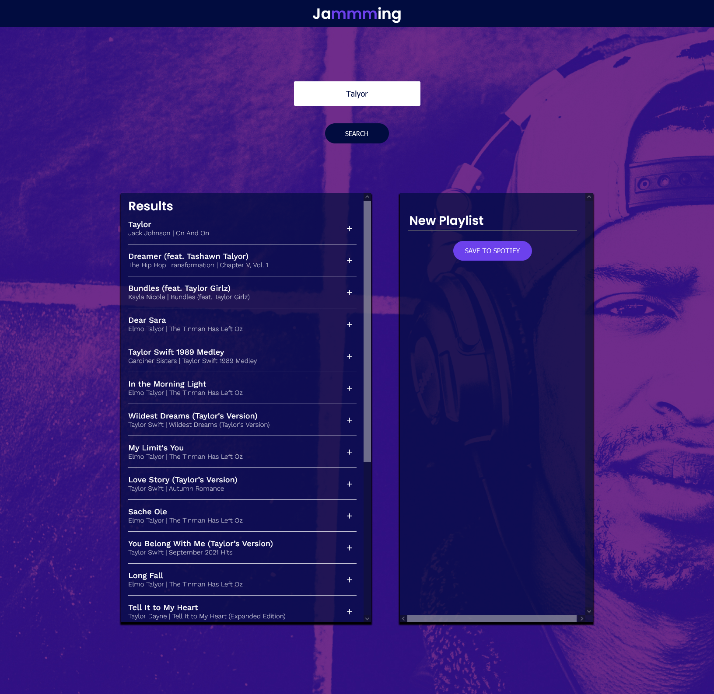

# Codeacdemy - Jamming

This is a project built as part of the Codecademy's Front End Engineer Course.
The website allows users to search the Spotify library, create a custom playlist, then save it to their Spotify account.

## Table of contents

- [Overview](#overview)
  - [Screenshot](#screenshot)
  - [Links](#links)
- [My process](#my-process)
  - [Built with](#built-with)
  - [What I learned](#what-i-learned)
- [Author](#author)

## Overview
### Screenshot

 

### Links

- Live Site URL:(https://jamming-mt.netlify.app/

## My process

### Built with

- React
- Spotify API

### What I learned
I learned how to create get and post request using fetch api in javaScript.
How to direct user to login page and redirect them back to website.
And how to Read Api documents.

## Author

- Website - [Mondara](https://mondarathotage.com/)
- Linkedin - [@Mondara](https://www.linkedin.com/in/mondara-thotage/)
- Github - [@Mondara](https://github.com/Mondara)

